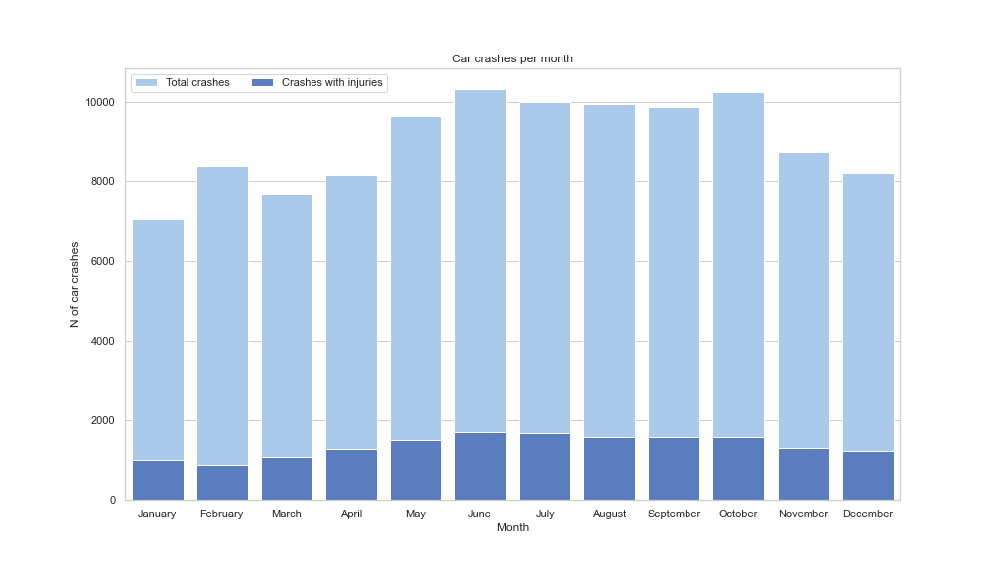

# Classification_project

# Vision Zero, Chicago, modeling car crashes with injuries.
# Overview
I was hired by a government agency CMAP (Chicago Metropolitan Agency for Planning) to create a model which predicts injuries during car crashes based on information collected by Chicago Police Department (CPD). I concluded that there are many features that determine the oucome of car crash(overall 200 features, only 31 were used in our model), some of them: type of crash , day, season, time, type of crash, are there injuried people, phyesical imparement factors(drugs, alchogol, distraction etc), speed limit, weather, lightning and road conditions etc .

To acheive my goal, I trained more than 100 models and tuned hyperparameters, model types that were used:

LogisticRegression
KNN
Naive Bayes(different type)
DecisionTree
Random Forest
ADA Boost
Gradient boost
XGB Classifier

# Business Understanding
Our stakeholder wants to understand what factors of crash influence on injury outcome as the last possible outcome. They perfectly understand that car crashes will be happening but they want to reduce the number of injuries because individual health prevails under public mobility.

# Data
1) Database Traffic Crashes - Crashes. Years: 2017 - now Provided by City of Chicago

https://data.cityofchicago.org/Transportation/Traffic-Crashes-Crashes/85ca-t3if

2) Database Traffic Crashes - People. Years: 2017 - now Provided by City of Chicago

https://data.cityofchicago.org/Transportation/Traffic-Crashes-People/u6pd-qa9d

3) Database Traffic Crashes - Vehicles. Years: 2017 - now Provided by City of Chicago

https://data.cityofchicago.org/Transportation/Traffic-Crashes-Vehicles/68nd-jvt3

In my research I used data for 2021 year.
# Metrics
### Our project will answer following question:
What factors influence injuries?

### Hypothesis:
H0 - car crashes with injuries are random

HA - There is a significant dependancy between injuries and the features of dataset

### TP, TN, FP, FN definition
TP - we predict car crash with injury and it actually happened.

TN - we predicted that there is no injury and there was no injury,

FP - We predicted injury but there was no injury in real life

FN - We predicted that there will be no injury but it happened

### Metrics used
To compare models we will focus on 2 major metrics:

Accuracy - how good we can predict TP and TN. General metrics that will show model performance.

Recall - Health of people is our priority, we will be focused to minimize FN, so we can consider as much real car crashes with injuries in our model as possible, even if our model mark some car crashes with injuries but there will be no such. From the other side we need consider accuracy.

# Data Understanding
### Sources of data:
1) Database Traffic Crashes - Crashes. Years: 2017 - now Covers: Main characteristics of car crash. Provided by City of Chicago https://data.cityofchicago.org/Transportation/Traffic-Crashes-Crashes/85ca-t3if

2) Database Traffic Crashes - People. Years: 2017 - now Covers: People/drivers involved in car crash. Provided by City of Chicago https://data.cityofchicago.org/Transportation/Traffic-Crashes-People/u6pd-qa9d

3) Database Traffic Crashes - Vehicles. Years: 2017 - now Covers: Vehicles involved in car crash. Provided by City of Chicago https://data.cityofchicago.org/Transportation/Traffic-Crashes-Vehicles/68nd-jvt3

### Main dataset contains the following columns:
'CRASH_RECORD_ID', - unique ID related to crash

'RD_NO', - unique ID related to crash

'CRASH_DATE_EST_I', - estimated car crash date

'CRASH_DATE', - car crash date

'POSTED_SPEED_LIMIT', - speed limit on a speed sign in this zone

'TRAFFIC_CONTROL_DEVICE', - traffic control device

'DEVICE_CONDITION', - was traffic control device working.

'WEATHER_CONDITION', - weather conditions

'LIGHTING_CONDITION', - lighting conditions

'FIRST_CRASH_TYPE', - type of crash

'TRAFFICWAY_TYPE', - type of road

'LANE_CNT', - how many lanes

'ALIGNMENT', - how they placed

'ROADWAY_SURFACE_COND',- road conditions

'ROAD_DEFECT', - defects on road

'REPORT_TYPE', - type of report (taken on place or delivered by car owners)

'CRASH_TYPE', - type of crash

'INTERSECTION_RELATED_I', - is it intersection related

'NOT_RIGHT_OF_WAY_I', - not right of way type crash

'HIT_AND_RUN_I', - hit and run crash?

'DAMAGE', - damaged divided into 3 categories

'DATE_POLICE_NOTIFIED', - when police was notified

'PRIM_CONTRIBUTORY_CAUSE', - primary cause of crash

'SEC_CONTRIBUTORY_CAUSE', - secondary cause of crash

'STREET_NO', - street N

'STREET_DIRECTION', - street direction

'STREET_NAME', - street name

'BEAT_OF_OCCURRENCE',

'PHOTOS_TAKEN_I', - was photo taken or no

'STATEMENTS_TAKEN_I', - was statement taken

'DOORING_I', - dooring type of crash

'WORK_ZONE_I', - work zone?

'WORK_ZONE_TYPE', - work zone type

'WORKERS_PRESENT_I', - are workers were present?

'NUM_UNITS', - number of units in crash?

'MOST_SEVERE_INJURY', - most severe injury

'INJURIES_TOTAL', - total injuries

'INJURIES_FATAL', - fatal injuries

'INJURIES_INCAPACITATING', incapacitating injuries

'INJURIES_NON_INCAPACITATING', non incapacitating injuries

'INJURIES_REPORTED_NOT_EVIDENT', reported but not evident type of injury

'INJURIES_NO_INDICATION', - no indication of injury

'INJURIES_UNKNOWN', injury unknown

'CRASH_HOUR', - crash hour

'CRASH_DAY_OF_WEEK', - crash day

'CRASH_MONTH', - crash month

'LATITUDE', 'LONGITUDE', 'LOCATION' - geolocational data.

# Data exploration

We checked our data for dependancies between different parameters and injury rate.
These data was represented below.
As a measure of correct modeling - we will check do our explore findings correspond to our model.

# Modeling
This project uses major classification models to make prediction.

We began by making bins for our data, so we reduce the model dimensionality and improve model performance and training speed. 


Than we split our data frame into two sections:
- Train 
- Test data
(as we can see later, some models perform very badly on test data even when they perform good to validation data)

Train data was splitted to train and validation data during later stages and we used cross validation to ensure the consistancy of results. 

We used SMOTE method to work with class imbalance problem and used several strategies.

After initial prediction of major model types we ended with 2 major model candidates:
Naive Bayes
Logistic regression. 

We tuned both of them to find the best possible solution.

#### After model tuning ligistic regression was selected as a final candidate. 
#### From our logistic regression we took factors that influence the most.

# Conclusion
For our finalized model we used LinearRegression because of the following reasons:

1) It is easy to interprete.

2) It have good recall compared to the other models, without much sacrifice in precision.

Overall, this data tells us that injuries during car crashes can be predicted and we can see tha major factors that influence it. These modeling results correspond to our observations during data exploration phase


# Further Questions
See the full analysis in the [Jupyter Notebook](https://github.com/314ka4y/Classification_project/blob/main/Car_crash_classification.ipynb) or review [this presentation](https://github.com/314ka4y/Classification_project/blob/main/project_presentation.pdf)


# Repository Structure
```
├── data                                       # Shows pickle files of data
├── img                                        # Contains visualizations produced by our models
├── README.md  
├── Car_crash_classification.ipynb             # Notebook , models
└── project_presentation.pdf                   # Presentation
```
# Results:

#### Data Exploration
Car crashes per month
