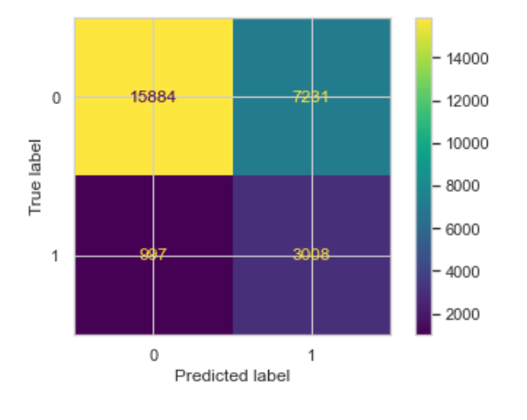

# Classification_project

# Vision Zero, Chicago, modeling car crashes with injuries.
# Overview
I was hired by a government agency CMAP (Chicago Metropolitan Agency for Planning), to create a model which predicts injuries during car crashes based on information collected by Chicago Police Department (CPD). I concluded that many features determine the outcome of a car crash(overall 200 features, only 31 were used in our model), some of them: type of crash, day, season, time, type of crash, are there injured people, physical impairment factors(drugs, alcohol, distraction, etc.), speed limit, weather, lighting and road conditions, etc.

To achieve my goal, I trained more than 100 models and tuned hyperparameters, model types that were used:

LogisticRegression
KNN
Naive Bayes(different type)
DecisionTree
Random Forest
ADA Boost
Gradient boost
XGB Classifier

# Business Understanding
Our stakeholder wants to understand what factors of crash influence on injury outcome as the last possible outcome. They perfectly understand that car crashes will be happening, but they want to reduce the number of injuries because individual health prevails under public mobility.

# Data
1) Database Traffic Crashes - Crashes. Years: 2017 - now Provided by City of Chicago

https://data.cityofchicago.org/Transportation/Traffic-Crashes-Crashes/85ca-t3if

2) Database Traffic Crashes - People. Years: 2017 - now Provided by City of Chicago

https://data.cityofchicago.org/Transportation/Traffic-Crashes-People/u6pd-qa9d

3) Database Traffic Crashes - Vehicles. Years: 2017 - now Provided by City of Chicago

https://data.cityofchicago.org/Transportation/Traffic-Crashes-Vehicles/68nd-jvt3

In my research, I used data for the 2021 year.
# Metrics
### Our project will answer the following question:
What factors influence injuries?

### Hypothesis:
H0 - car crashes with injuries are random

HA - There is a significant dependency between injuries and the dataset's features.

### TP, TN, FP, FN definition
TP - we predict a car crash with injury, and it happened.

TN - we predicted that there would be no injury, and there was no injury,

FP - We predicted injury, but there was no injury in real life

FN - We predicted that there would be no injury, but it happened.

### Metrics used
To compare models, we will focus on two primary metrics:

Accuracy - how well we can predict TP and TN. These are our general metrics that will show model performance.

Recall - Health of people is our priority; we will be focused on minimizing FN, so we can consider as many real cars crash with injuries in our model as possible, even if our model mark some vehicle crashes with injuries when there weren't no such. On the other side, we need to consider accuracy.

# Data Understanding
### Sources of data:
1) Database Traffic Crashes - Crashes. Years: 2017 - now Covers: Main characteristics of a car crash. Provided by City of Chicago https://data.cityofchicago.org/Transportation/Traffic-Crashes-Crashes/85ca-t3if

2) Database Traffic Crashes - People. Years: 2017 - now Covers: People/drivers involved in a car crash. Provided by City of Chicago https://data.cityofchicago.org/Transportation/Traffic-Crashes-People/u6pd-qa9d

3) Database Traffic Crashes - Vehicles. Years: 2017 - now Covers: Vehicles involved in a car crash. Provided by City of Chicago https://data.cityofchicago.org/Transportation/Traffic-Crashes-Vehicles/68nd-jvt3

### Main dataset contains the following columns:
'CRASH_RECORD_ID', - unique ID related to crash

'RD_NO', - unique ID related to the crash

'CRASH_DATE_EST_I', - estimated car crash date

'CRASH_DATE', - car crash date

'POSTED_SPEED_LIMIT', - the speed limit on a speed sign in this zone

'TRAFFIC_CONTROL_DEVICE', - traffic control device

'DEVICE_CONDITION' - was the traffic control device working.

'WEATHER_CONDITION', - weather conditions

'LIGHTING_CONDITION', - lighting conditions

'FIRST_CRASH_TYPE', - type of crash

'TRAFFICWAY_TYPE', - type of road

'LANE_CNT', - how many lanes

'ALIGNMENT' - how they placed

'ROADWAY_SURFACE_COND',- road conditions

'ROAD_DEFECT', - defects on road

'REPORT_TYPE', - the type of report (taken on place or delivered by car owners)

'CRASH_TYPE', - type of crash

'INTERSECTION_RELATED_I', - is it intersection related.

'NOT_RIGHT_OF_WAY_I', - not right of way type crash

'HIT_AND_RUN_I', - hit and run crash?

'DAMAGE', - damaged divided into three categories

'DATE_POLICE_NOTIFIED', - when police was notified

'PRIM_CONTRIBUTORY_CAUSE', - the primary cause of the crash

'SEC_CONTRIBUTORY_CAUSE', - secondary cause of the crash

'STREET_NO', - street N

'STREET_DIRECTION', - street direction

'STREET_NAME', - street name

'BEAT_OF_OCCURRENCE',

'PHOTOS_TAKEN_I', - was the photo taken or not.

'STATEMENTS_TAKEN_I', - was a statement taken.

'DOORING_I', - dooring type of crash

'WORK_ZONE_I', - work zone?

'WORK_ZONE_TYPE', - work zone type

'WORKERS_PRESENT_I', - are workers present?

'NUM_UNITS', - the number of units in the crash?

'MOST_SEVERE_INJURY', - most severe injury

'INJURIES_TOTAL', - total injuries

'INJURIES_FATAL', - fatal injuries

'INJURIES_INCAPACITATING', incapacitating injuries.

'INJURIES_NON_INCAPACITATING', non-incapacitating injuries

'INJURIES_REPORTED_NOT_EVIDENT', reported but not the evident type of injury.

'INJURIES_NO_INDICATION', - no indication of injury

'INJURIES_UNKNOWN', injury unknown

'CRASH_HOUR', - crash hour

'CRASH_DAY_OF_WEEK', - crash day

'CRASH_MONTH', - crash month

'LATITUDE', 'LONGITUDE', 'LOCATION' - geolocational data.

# Data exploration

We checked our data for dependencies between different parameters and injury rates.
These data are represented below.
As a measure of accurate modeling - we will check do our explore findings correspond to our model.

# Modeling
This project uses major classification models to make predictions.

We began by making bins for our data, reducing the model dimensionality, and improving model performance and training speed. 


Then, we split our data frame into two sections:
- Train 
- Test data
(as we can see later, some models perform very severely on test data even when they perform well to validation data)

Train data was split to train and validation data during later stages, and we used cross-validation to ensure the consistency of results. 

We used the SMOTE method to work with the class imbalance problem and several strategies.

After initial prediction of major model types, we ended with two major model candidates:
Naive Bayes
Logistic regression. 

We tune both of them to find the best possible solution.

#### After model tuning logistic regression was selected as a final candidate. 
#### From our logistic regression, we took factors that influence the most.

# Conclusion
For our finalized model, we used LogisticRegression because of the following reasons:

1) It is easy to interpret.

2) It has a good recall compared to the other models without sacrificing precision.

Overall, this data tells us that injuries during car crashes can be predicted, and we can see the major factors that influence them. Furthermore, these modeling results correspond to our observations during the data exploration phase.


# Further Questions
See the full analysis in the [Jupyter Notebook](https://github.com/314ka4y/Classification_project/blob/main/Car_crash_classification.ipynb) or review [this presentation](https://github.com/314ka4y/Classification_project/blob/main/project_presentation.pdf)


# Repository Structure
```
├── data                                       # Shows pickle files of data
├── img                                        # Contains visualizations produced by our models
├── README.md  
├── Car_crash_classification.ipynb             # Notebook , models
└── project_presentation.pdf                   # Presentation
```
# Results:

#### Data Exploration

Car crashes per month


Car crashes per month with injuries


Injuries during the day


Injuries traffic control devices


Injuries on different road types


Crash map


Injuries map


#### Modeling

performance of different models with different strategies against imbalance problem
 

Final model selection after hyperparameters tuning


Final model confusion matrix


Main contributors to car crash


Main preventive factors from car crash

